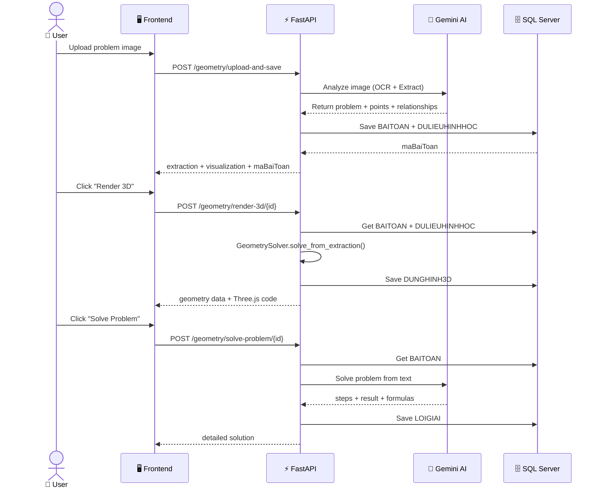
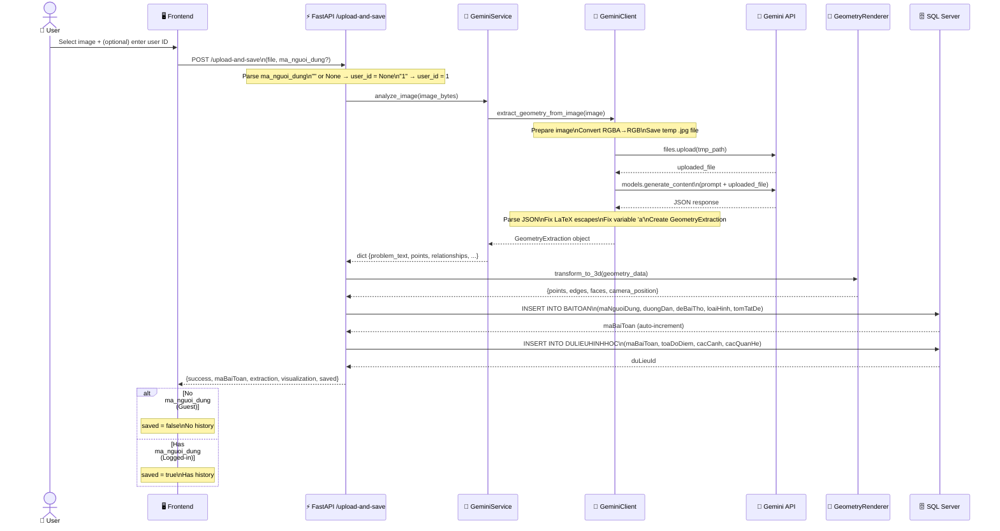
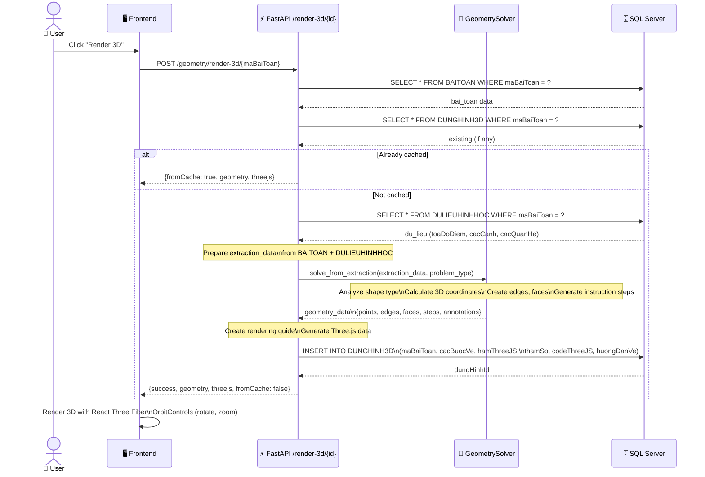
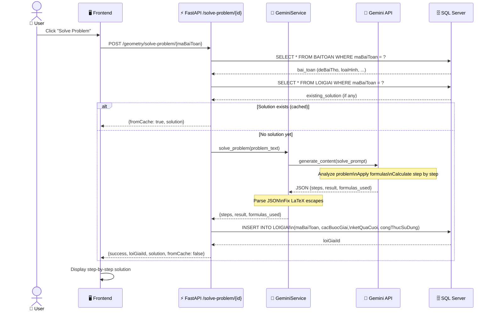
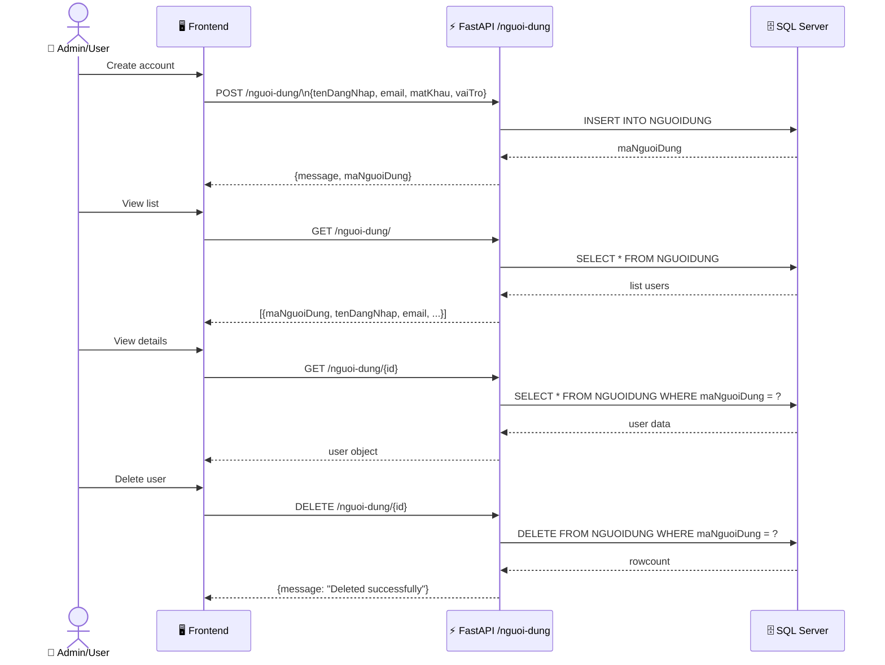
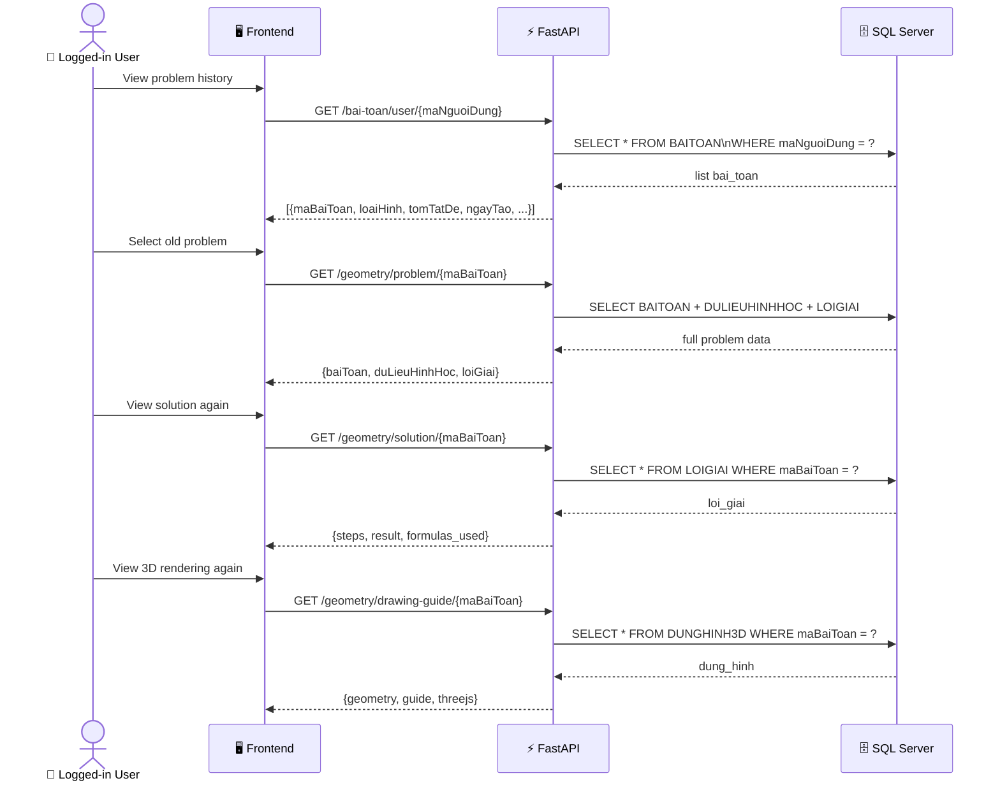
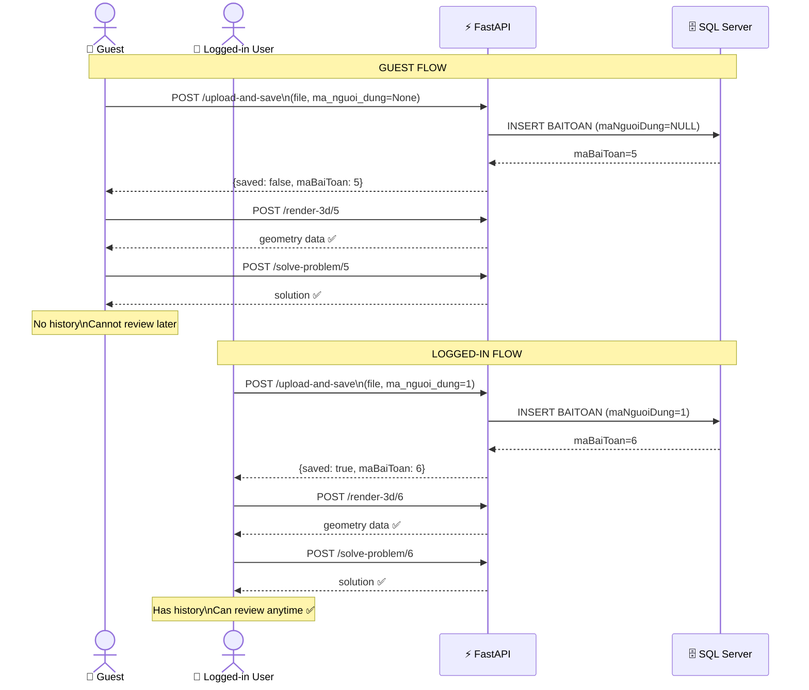
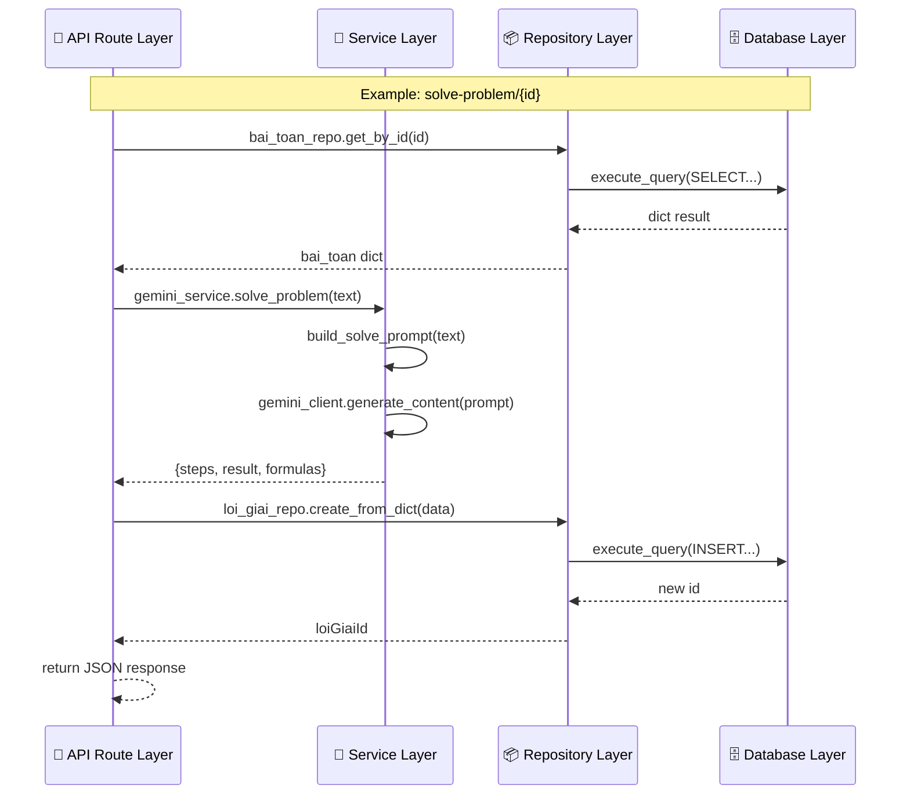

# Sequence Diagrams - 3D Geometry Problem Solving System

## 1. Overall Flow

---

## 2. Step 1: Upload and Image Analysis

---

## 3. Step 2: 3D Rendering

---

## 4. Step 3: Problem Solving

---

## 5. User Management

---

## 6. View History (Logged-in User)

---

## 7. Comparison: Guest vs Logged-in

---

## 8. Layered Architecture

